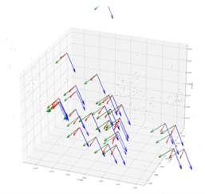

# LbD_vision_robot_arm
## 1) Installation
### [1.1) Network Setup](docs/network_setup.md)
Our system consist of 4 machines connected by local network including
- **PC-A** for robot trajectories planning & control
- **PC-B** for computer vision tasks
- UR5e robot arm (right side)
- UR5e robot arm (left side)

### 1.2) Workspace Setup
Clone this repository on both **PC-A** and **PC-B**
```sh
cd ~
git clone https://github.com/VISTEC-IST-ROBOTICS-PUBLIC/PBD
```
Copy computer vision package to your workspace on **PC-B**
```sh
mkdir -p ~/dev/src/ # Create workspace (if not exist)
cp ~/PBD/dev_ws/src/vlib ~/dev/src/
```
### [1.3) Middleware Setup](docs/middleware_setup.md)


Since our system use both ROS1 and ROS2, the middleware is neccessary for communication between both side. We choose [eProsima](https://www.eprosima.com/) integration service for this task by its simplicity.

#### Launch Integration Service
Use [camera_calibration.yaml](middleware/ros2_ws/src/vlib_msgs/is/UR5e_demo/camera_calibration.yaml) to launch the eProsima Integration Service during **Robot** &harr; **Camera** frame calibration.
```sh
# Open new session
# Source both ROS1, ROS2 and Integration Service
cd ~/is-workspace
source /opt/ros/noetic/setup.bash
source /opt/ros/foxy/setup.bash
source ~/is-workspace/install/setup.bash
# Launch the integration-service with prepared config file
integration-service $(PATH_TO)/camera_calibration.yaml
```

### 1.4) Camera Calibration
After installation we need to proceed **Robot** &harr; **Camera** frame calibration to get precise transformation of camera related to robot ($\text{H}^{robot}_{cam}$).

#### On **PC-A** run:
```sh
cd ~/dual_arm_driver/scripts/
python camera_frame_calibrate.py
```
#### On **PC-B** run:
##### [Launch Integration Service](#launch-integration-service)
Don't forget to setup *ROS_MASTER_URI* and *ROS_IP* before launch the integration-service
```sh
export ROS_MASTER_URI=http://192.168.1.11:11311 # Replace this with PC-A IP Address
export ROS_IP=192.168.1.46                      # Replace this with PC-B IP Address
```

##### Launch Realsense Camera Node & Aruco Cube Pose Estimator Node
```sh
# New session
cd ~/dev_ws/                    # Enter workspace
source /opt/ros/foxy/setup.bash # Source ROS2 installation
colcon build                    # Build the package
source install/setup.bash       # Source package installation
ros2 launch vlib_core demo.launch.py # Launch Camera & Aruco Cube Pose Estimator Node
```
##### Run Calibration Node
This node will order the robot arm to move to random poses for 25 times (configurable via *calibration_rounds* node parameter).
```sh
# New session
ros2 run vlib camera_frame_calibration.py
```
During calibration, this node will gather both $`\text{H}^{base}_{tcp}`$ (from Robot's forward kinematic) and $`\text{H}^{cam}_{cube}`$ (from Aruco Cube 3D-pose estimation). After calibration process, this node will save the results as NumPy zipped archive at **~/dev_ws/poses.npz** which contain multiple set of *timestamp*, $`\text{H}^{base}_{tcp}`$, and $`\text{H}^{cam}_{cube}`$.


##### Post-process the calibration data
We already know $\text{H}^{tcp}_{cube}$ from its [CAD](dev_ws/src/vlib/vlib_description/meshes/Calibration_CUBE_UR_50mm%20v3.stl) which is:
```math
\text{H}^{tcp}_{cube}=\begin{bmatrix}
1 & 0 & 0 & 0 \\
0 & 1 & 0 & 0.0175 \\
0 & 0 & 1 & 0 \\
0 & 0 & 0 & 1
\end{bmatrix}
```


For each pair of $`\text{H}^{base}_{tcp}`$ and $`\text{H}^{cam}_{cube}`$ from [calibration node](#run-calibration-node), we can calculate transformation of camera frame related to robot base frame ($`\text{H}^{base}_{cam}`$) from:

```math
\text{H}^{base}_{cam}=\text{H}^{base}_{tcp} \text{H}^{tcp}_{cube} (\text{H}^{cam}_{cube})^{-1}
```

We use a script [calibration_postprocess.py](dev_ws/src/vlib/vlib_core/scripts/calibration_postprocess.py) to do this process and calculate mean of $\text{H}^{base}_{cam}$ from multiple pairs of $`\text{H}^{base}_{tcp}$ and $\text{H}^{cam}_{cube}`$ above. Result will be like this:



## 2) Hand Trajectory
#### On **PC-B** run:
```sh
cd ~/PBD/hand_detector/
python hand_realsense_3D.py
```

## 3) Obstacle Avoidance
#### On **PC-A** run:
```sh
cd ~/dual_arm_driver/scripts/
python A_dmp_hand.py
```
#### On **PC-B** run:
Detect pre-defined obstacle and publish it's 3D position
```sh
ros2 run vlib_core cup_detector.py  # 3D object detector (cup)
```
