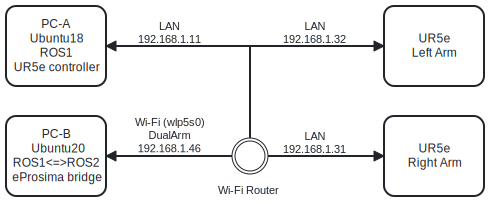

## Network Setup

Our system has 4 machine connected through Ethernet (LAN cable & Wi-Fi) with single Wi-Fi router and consist of both ROS1 and ROS2 system.
#### PC-A
IP Address: 192.168.1.11
- Ubuntu 18.04 LTS
- ROS1 melodic
#### PC-B
IP Address: 192.168.1.46
- Ubuntu 20.04 LTS
- ROS1 noetic
- ROS2 foxy
- eProsima Integration Service
- Intel Realsense D435 Depth Camera
#### UR5e
##### - Right Arm
IP Address: 192.168.1.31
- ROS1 melodic
##### - Left Arm
IP Address: 192.168.1.32
- ROS1 melodic